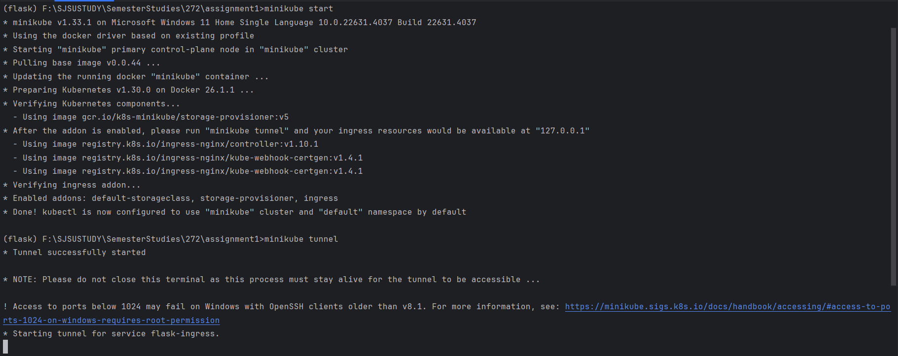
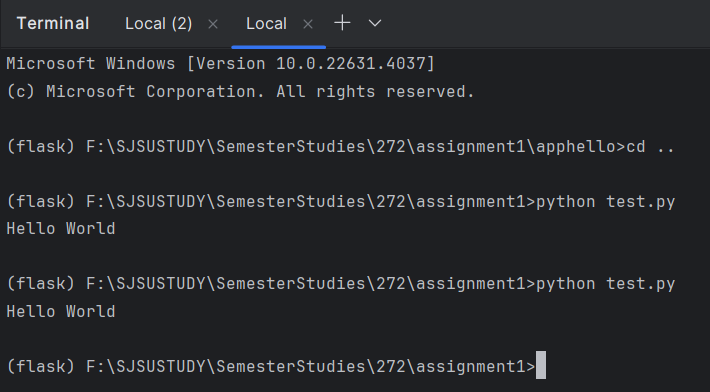
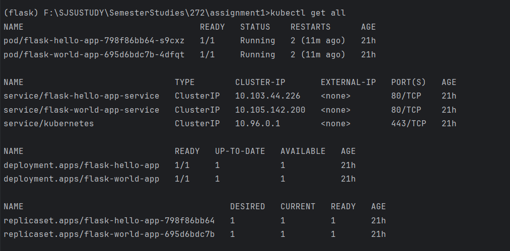
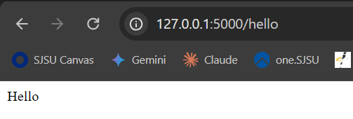
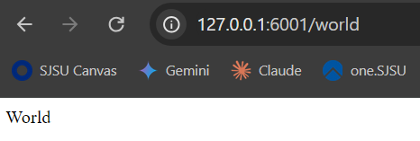

CMPE272Assignment1
=======
# Assignment 1 : Hello World from MicroServices
## Author : Pratikkumar Dalsukhbhai Korat
### SJSU ID : 017512508

* This project runs two microservices on a Kubernetes cluster, which are queried together to produce a "Hello World" output.

## Technologies Used in this Application
> 1. Python (hello and world application)
> 2. Minikube
> 3. Docker

## How to Run Applications individually

### 1. appHello Application
> 1. Move into directory apphello/
> 2. open CMD and run following command "pip install -r requirements.txt"
> 3. run following command "python main.py"
> 4. Application will be live on localhost and port number 5000 "http://localhost:5000/hello"

### 1. appWorld Application
> 1. Move into directory appworld/
> 2. open CMD and run following command "pip install -r requirements.txt"
> 3. run following command "python main.py"
> 4. Application will be live on localhost and port number 6001 "http://localhost:6001/hello"

### Docker Images Built Using this Applications
> * apphello application docker image
>   * pratikkorat/flask-hello-app 

> * appworld application docker image
>   * pratikkorat/flask-world-app
 

> 1. To run and pull apphello application using docker image, run following commands
>    1. "docker pull pratikkorat/flask-hello-app"
>    2. "docker run -p 5000:5000 pratikkorat/flask-hello-app"
>    3. open "http://localhost:5000/hello"
 

> 2. To pull appworld docker image,run following command
>    * "docker pull pratikkorat/flask-world-app"
>    * "docker run -p 6001:6001 pratikkorat/flask-world-app"
>    * open "http://localhost:6001/world"

> Links to docker image
> 1. https://hub.docker.com/repository/docker/pratikkorat/flask-hello-app/general
> 2. https://hub.docker.com/repository/docker/pratikkorat/flask-world-app/general

## Running mircroservices on Kubernetes Cluster using minikube

> 1. open CMD and run following command
>    * minikube start

> 2. run "minikube addons enable ingress"

> 3. Deployment objects
>    * Go into /kubernetes directory
>       * run "kubectl apply -f deploymenthello.yaml"
>       * run "kubectl apply -f deploymentworld.yaml"

> 4. Serivce Objects
>    * run "kubectl apply -f apphello-service.yaml"
>    * run "kubectl apply -f appworld-service.yaml"

> 5. Run ingress service command
>    * run "kubectl apply -f ingress-service.yaml"

> 6. Check everthing is running smoothly
>    * kubectl get all

> 7. Run minikube tunnel
>   * run "minikube tunnel"

> 8. Both service will be running on kubernetes cluster and accessible at
>    * http://localhost/hello
>    * http://localhost/world

> 9. Go to the project directory
>    * run "python test.py"

## Results

### 1. Minikube start and running

### 2. Running script

### 3. Cluster Information

### 4. Hello App

### 5. World app
